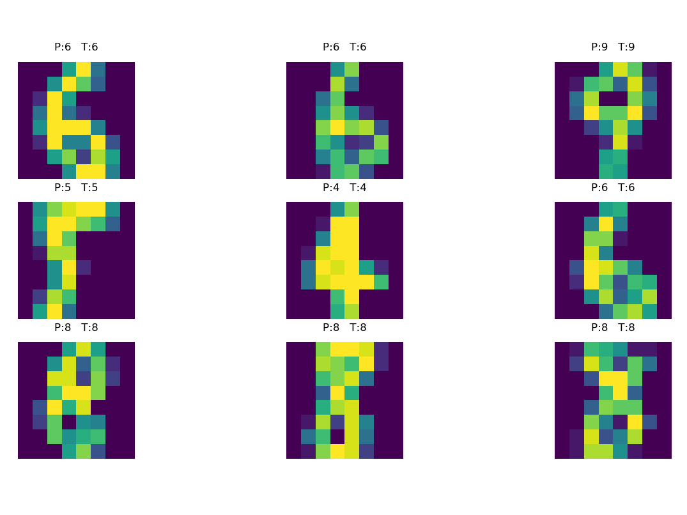

## 应用综合实验 - 整理 Data Analysis & Medical Learning

- 统计字母/单词的频率 + 可视化

  ```shell
  python .\countFrequencyGUI.py --filePath '../Data/bio.txt' --sort --countLetter
  ```

  |                                   |                                   |                                   |
  | --------------------------------- | --------------------------------- | --------------------------------- |
  |  |  |  |

  

- 批量重命名

  ```shell
  python .\renamefilter.py myimage###.jpg
  ```

  

- 收发邮件

  ```shell
  python .\readMail.py
  python .\send.py		python sendMail.py
  ```

  

- 模拟股票涨跌（尚未使用爬虫，利用随机数模拟，动态图）

  ```shell
  python .\showTime.py --update 0.1 --xmax 100 --fixed
  ```

  

- 手动实现K-means

  ```shell
  python .\kmeans.py --n_iteration 100 --n_clusters 4
  ```
  |                        |                        |
  | ---------------------- | ---------------------- |
  |  |  |


- 手写MLP（只写了一个输入层一个隐层一个输出层）

  ```shell
  python .\BpNN.py		# epoch: 19000 accuracy: 0.9777777777777777
  ```
  |                        |                        |
  | ---------------------- | ---------------------- |
  |  |  |


